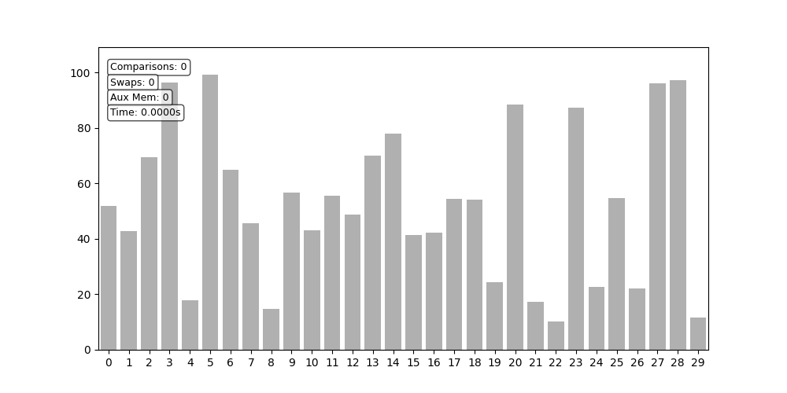

# Sorting Visualizer

An educational tool that visualizes six classic sorting algorithms with
step‑by‑step animation and real‑time metrics.



## Features

- **Six algorithms**: Bubble Sort, Insertion Sort, Merge Sort, Quick Sort,
  Heap Sort, Counting Sort.
- **Step‑by‑step animation** with highlighted comparisons and swaps.
- **Real‑time HUD**: comparisons, swaps, auxiliary memory used, and elapsed
  time (pauses excluded).
- **Two operating modes**:
  - *Interactive*: guided console prompts to choose algorithm, array, and speed.
  - *Batch*: command‑line arguments (e.g. `--algorithm bubble --size 50 --interval 50`).
- **Playback controls**: pause/resume (`Space`) and frame‑by‑frame step (`→`).
- **Export**:
  - Save animation as **GIF** or **MP4**.
  - Save trace states as **CSV** or **JSON** (all frames or key frames only).
- **Algorithm comparison** (upcoming) – side‑by‑side synchronized animation.
- **User settings persistence** between interactive sessions.
- **Cross‑platform**: Windows, macOS, Linux.

## Quick start

1. Clone the repository:
    ```bash
   git clone https://github.com/yourusername/sorting-visualizer.git
   cd sorting-visualizer

2. Create and activate a virtual environment:
    ```bash
   python -m venv venv
   source venv/bin/activate      # Linux/macOS
   venv\Scripts\activate         # Windows

3. Install dependencies:
    ```bash
    pip install -e ".[dev]"

4. Launch interactive mode:
      ```bash
      python -m src.ui.console_ui --interactive
      or(!)
      python -m src.ui.console_ui --algorithm bubble --size 20 --interval 100

5. Export an animation:
    ```bash
    python -m src.ui.console_ui --algorithm quick --size 30 --export-gif quick_sort.gif

## Available algorithms

*by 1) Algorithm name; 2) Average complexity; 3) Extra memory; 4) Notes.*

**Bubble Sort**;	O(n²);	O(1);	*Simple comparison‑based*.\
**Insertion Sort**;	O(n²;)	O(1);	*Efficient on partially sorted data*.\
**Merge Sort**;	O(n log n);	O(n);	*Iterative bottom‑up implementation*.\
**Quick Sort**;	O(n log n);	O(log n)*;	*3‑way partition, median‑of‑three pivot*.\
**Heap Sort**;	O(n log n);	O(1);	*In‑place heap construction*.\
**Counting Sort**;	O(n + k);	O(n + k);	*Non‑negative integers only*.

## Technologies

**Python 3.10+**,
**matplotlib** *(animation and drawing)*,
**numpy**,
**Pillow** *(GIF export)*,
**pytest** *(testing)*,
**black, ruff, mypy** *(code style and type checking)*

## Educational value

This project is designed to help students and developers understand sorting
algorithms through direct visualisation. Every swap, comparison, and memory
allocation is visible in real time. The source code itself serves as an example
of generator‑based algorithm design, type annotations, and SOLID architecture.

## License

This project is licensed under the MIT License. See [LICENSE](https://github.com/AshtonPL1/sorting-visualizer/blob/main/LICENSE) for details.

## Contact

### Author: Borovoy Nikita
### Email: nurmag00@bk.ru
### GitHub: [AshtonPL1](https://github.com/AshtonPL1)
